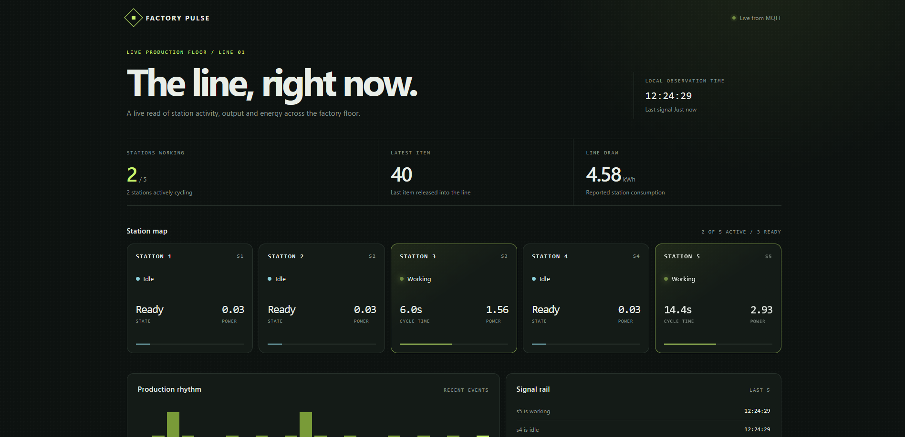
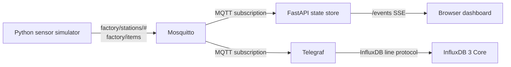

# Factory Pulse

Factory Pulse is a small, Docker-first factory telemetry stack. A Python simulator publishes station and production events over MQTT; FastAPI consumes those events and pushes a live operations dashboard over Server-Sent Events (SSE); Telegraf stores a separate telemetry stream in InfluxDB 3 Core.



The dashboard is intentionally an operator view rather than a generic analytics page: it shows which of the five stations are working, the latest item entering the line, reported power, recent production rhythm, and the health of the MQTT connection.

## What It Includes

- **Mosquitto**: local MQTT broker on `1883`.
- **Sensors simulator**: publishes realistic station cycles and item events.
- **FastAPI**: subscribes to MQTT and serves the dashboard, JSON state, and SSE.
- **InfluxDB 3 Core**: local time-series storage on `8181`.
- **Telegraf**: consumes MQTT telemetry and writes it to InfluxDB.

## Quick Start

### Prerequisites

- Docker Engine with the Compose plugin
- Ports `8000`, `1883`, `8181`, and `9001` available
- A shell in the project directory

### 1. Create local configuration files

The real `.env` and `admin-token.json` files are ignored by Git. Create them from the safe examples:

```bash
cp .env.example .env
cp admin-token.example.json admin-token.json
```

Generate a local token and use the same value in both files:

```bash
TOKEN="$(openssl rand -hex 32)"
sed -i "s/replace-with-a-local-influx-admin-token/$TOKEN/" admin-token.json
sed -i "s/replace-with-a-local-influx-token/$TOKEN/" .env
```

If `openssl` is unavailable, replace the placeholder manually with a long random value.

### 2. Start the stack

```bash
docker compose up -d --build
```

Open the dashboard at **<http://localhost:8000>**.

Useful commands:

```bash
# Follow all service logs
docker compose logs -f

# Follow only the dashboard and simulator
docker compose logs -f fastapi sensors

# Check container status
docker compose ps

# Stop the stack
docker compose down
```

The simulator starts publishing automatically. After it connects, the dashboard should show the five stations as `idle` or `working`, a current item number, and `Live from MQTT`.

## Using The Dashboard

The browser uses two FastAPI routes:

| Route | Purpose |
| --- | --- |
| `/` | Factory Pulse dashboard |
| `/api/state` | Current JSON snapshot for scripts or debugging |
| `/events` | SSE stream of snapshots and MQTT connection events |

Inspect the current state:

```bash
curl http://localhost:8000/api/state
```

Inspect the SSE stream:

```bash
curl -N http://localhost:8000/events
```

The UI updates when the backend receives either of these MQTT topics:

- `factory/stations/<station-id>`
- `factory/items`

A station event looks like this:

```json
{
  "asset_id": "s1",
  "status": "working",
  "power_consumption": 1.84,
  "cycle_time": 8.42,
  "timestamp": "2026-09-18T12:00:00-03:00"
}
```

An item event looks like this:

```json
{
  "count": 12,
  "timestamp": "2026-09-18T12:00:00-03:00"
}
```

To publish a test event from the host, install an MQTT client such as `mosquitto-clients` and run:

```bash
mosquitto_pub -h localhost -p 1883 \
  -t factory/stations/s1 \
  -m '{"asset_id":"s1","status":"working","power_consumption":2.1,"cycle_time":9.2}'

mosquitto_pub -h localhost -p 1883 \
  -t factory/items \
  -m '{"count":99}'
```

Inside another Compose service, use `mosquitto:1883`. From the host, use `localhost:1883`.

## Configuration Files

### `.env`

Copy `.env.example` to `.env`. Compose injects `INFLUXDB_TOKEN` into Telegraf, while the MQTT host and port are used by the Python services.

Example:

```env
HOST_MOSQUITTO=mosquitto
PORT_MOSQUITTO=1883
INFLUXDB_TOKEN=replace-with-a-local-influx-token
```

### `admin-token.json`

InfluxDB 3 Core reads the token through the Compose secret mounted at `/run/secrets/admin-token`.

Example:

```json
{
  "token": "replace-with-a-local-influx-admin-token",
  "name": "admin",
  "description": "Local development token"
}
```

Keep both files private. Never commit real tokens, passwords, or cloud credentials.

### Mosquitto permissions

Mosquitto runs as UID/GID `1883` in the official image. Because `mosquitto/data` and `mosquitto/log` are bind mounts, the container must be allowed to write them. On a fresh Linux checkout:

```bash
sudo chown -R 1883:1883 mosquitto/data mosquitto/log
```

The local broker is configured with anonymous access for development. Do not expose this configuration to an untrusted network.

## Architecture



### Why these technologies?

#### Python simulator

The simulator is deliberately Python because the domain behavior is easy to express with threads, locks, random cycle times, and structured JSON. It can model multiple items moving through the five stations without requiring real hardware. The same MQTT contract can later be used by physical PLC gateways or edge collectors.

#### MQTT and Mosquitto

MQTT is a good fit for factory events because it is lightweight, topic-oriented, and decouples producers from consumers. A station can publish without knowing whether the consumer is the dashboard, Telegraf, an alerting worker, or a future historian. Mosquitto gives the project a small local broker with no external dependency during development.

The trade-off is that MQTT is an event transport, not a durable query model. The FastAPI process keeps an in-memory snapshot for the live screen, while InfluxDB is responsible for historical time-series storage.

#### FastAPI

FastAPI provides a small asynchronous HTTP layer with clear route definitions and a straightforward application lifespan. The MQTT client runs in its network loop, and callbacks copy validated JSON-like state into a lock-protected in-memory store. This keeps the dashboard responsive without putting blocking MQTT work on the HTTP event loop.

#### Server-Sent Events

SSE is a natural fit for this dashboard because data flows from the server to the browser. It uses standard HTTP, reconnects through `EventSource`, and avoids the extra protocol and bidirectional complexity of WebSockets. If the product later needs browser commands such as starting or stopping a line, WebSockets or normal POST routes could be added for those commands while retaining SSE for telemetry.

#### InfluxDB 3 Core

Factory signals are time-series data: power, cycle duration, status transitions, and production counts indexed by time. InfluxDB is optimized for that shape and gives Telegraf a natural destination. The local file-backed object store makes the demo reproducible without requiring a hosted database.

#### Telegraf

Telegraf is used as the integration boundary for telemetry persistence. Its MQTT input and InfluxDB output are configuration-driven, so changing the destination or adding another measurement does not require changing the FastAPI dashboard process.

### Runtime boundaries

- **Live UI state** lives in FastAPI memory and is lost when the container restarts.
- **Historical telemetry** belongs in InfluxDB.
- **Transport** belongs to Mosquitto.
- **Simulation** belongs to `sensors.py` and can eventually be replaced by real producers.

## Topic Contract Note

The simulator and dashboard currently use the `factory/*` topic family:

```text
factory/stations/<station-id>
factory/items
```

The current `telegraf.conf` still contains `fabrica/*` input topics from an earlier telemetry model. That means the dashboard and simulator can work independently of Telegraf, but Telegraf will not ingest the simulator's `factory/*` messages until those input topics are aligned. To persist the simulator data, change the Telegraf topics to:

```toml
[[inputs.mqtt_consumer]]
  servers = ["tcp://mosquitto:1883"]
  topics = ["factory/stations/+"]
  data_format = "json_v2"

[[inputs.mqtt_consumer]]
  servers = ["tcp://mosquitto:1883"]
  topics = ["factory/items"]
  data_format = "json_v2"
```

Then define the matching `json_v2` field mappings for the payloads above.

## Local Development Without Docker

Docker Compose is the recommended path because it supplies the broker and InfluxDB network names. For backend-only work, install dependencies into a virtual environment:

```bash
python -m venv .venv
source .venv/bin/activate
pip install -r requirements.txt
```

Start FastAPI locally while keeping Mosquitto available at `localhost`:

```bash
HOST_MOSQUITTO=localhost PORT_MOSQUITTO=1883 \
  fastapi run main.py --port 8000
```

Start the simulator in another shell:

```bash
HOST_MOSQUITTO=localhost PORT_MOSQUITTO=1883 python sensors.py
```

For this mode, start Mosquitto and InfluxDB separately, or run only those services through Compose:

```bash
docker compose up -d mosquitto influxdb3-core
```

## Troubleshooting

### The dashboard says `Broker offline`

Check the backend state and logs:

```bash
curl http://localhost:8000/api/state
docker compose logs --tail=100 fastapi mosquitto
```

Inside Docker, the broker hostname is `mosquitto`; `localhost` would point back to the FastAPI container itself.

### Mosquitto cannot open its log file

Fix the bind-mount ownership:

```bash
sudo chown -R 1883:1883 mosquitto/log mosquitto/data
```

### FastAPI fails while installing requirements

The requirements file should contain package versions, not an SSH editable dependency pointing back to this repository. Rebuild after changing dependencies:

```bash
docker compose build --no-cache fastapi
```

### The dashboard is empty

Confirm that the simulator is running and publishing:

```bash
docker compose ps sensors
docker compose logs -f sensors
```

You can also publish a manual message using the examples above.

## Project Layout

```text
.
├── main.py                    # FastAPI app, MQTT consumer, state store, SSE
├── sensors.py                 # Factory event simulator
├── mqtt.py                    # Shared MQTT helper
├── templates/index.html       # Factory Pulse dashboard
├── telegraf.conf              # MQTT-to-InfluxDB pipeline
├── docker-compose.yaml        # Local service topology
├── FastapiDockerfile          # FastAPI image
├── SensorsDockerfile          # Simulator image
├── mosquitto/config/          # Broker listeners and persistence
├── .env.example               # Safe environment template
└── admin-token.example.json   # Safe InfluxDB token template
```

## Security Notes

- Replace all example values before using the project outside local development.
- Rotate any token that has ever been committed or shared.
- Disable `allow_anonymous` and configure Mosquitto authentication for a real deployment.
- Do not publish MQTT, InfluxDB, or admin interfaces directly to the public internet.
- Use pinned image tags and dependency versions for reproducible deployments.
